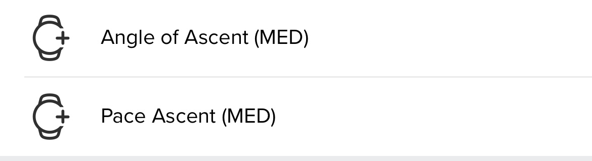
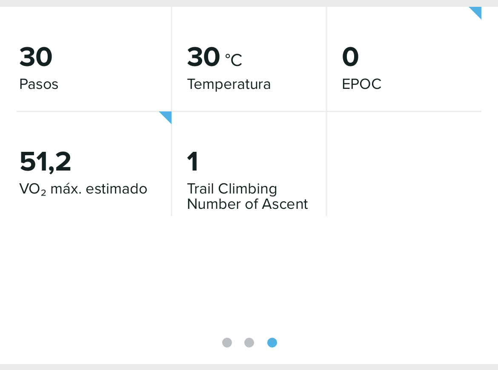

# Trail Running Climbing
Suunto App Trail Running Climbing

This app is designed to show the meters climbed on each Ascent/Descent. It shows the Cadence on the Ascent, the meters Climbed and the number of Attempts the Climb Angle Ascent. Saves in the SA the number of times we completed Ascent/Descent in a training. Saves in SA Suunto Plus the Cadence that you spend in Ascent and for each Ascent/Descent plus the Climb Angle Ascent. Generates a lap every time you finish the route or Ascent/Descent ***(you can also force that you have finished the Ascent/Descent or route by pressing the lap button)***.

### Screen Design:
    

 
 
### SA Outputs:
  #### Suunto Plus Metrics to analize later in SA
  
    
   
  #### SA Summary Outputs
  
    
   
---
### :fire: My Stats :

